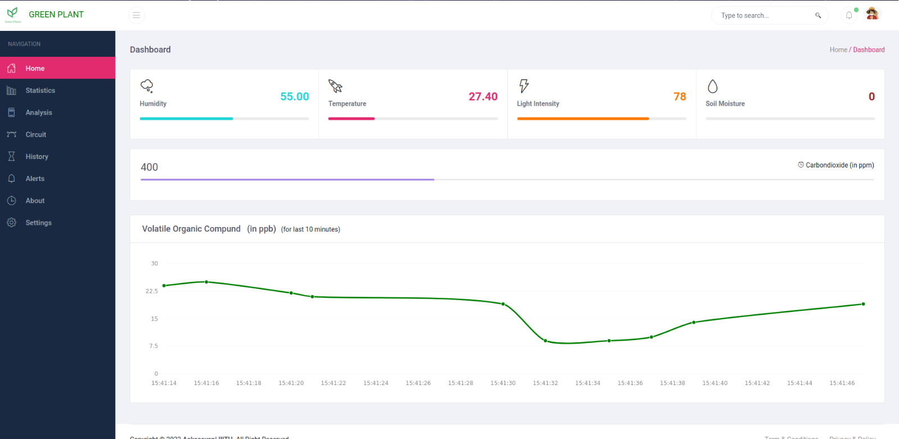
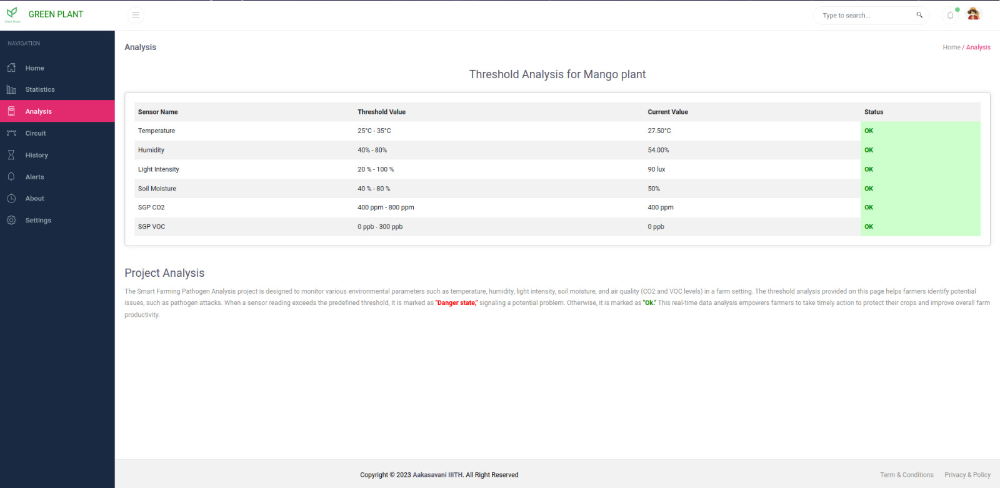
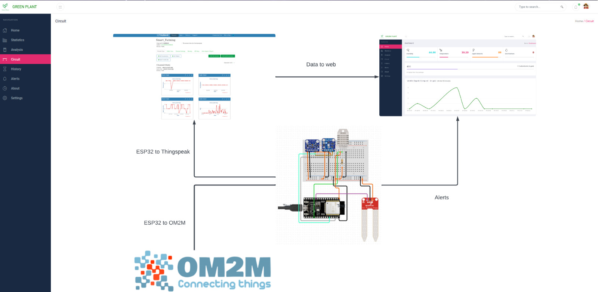
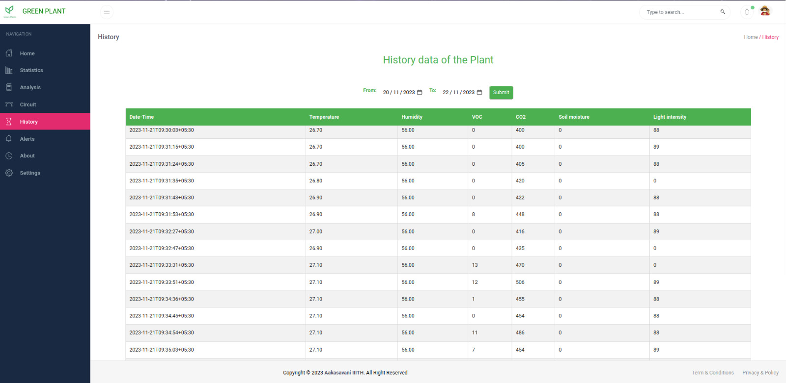
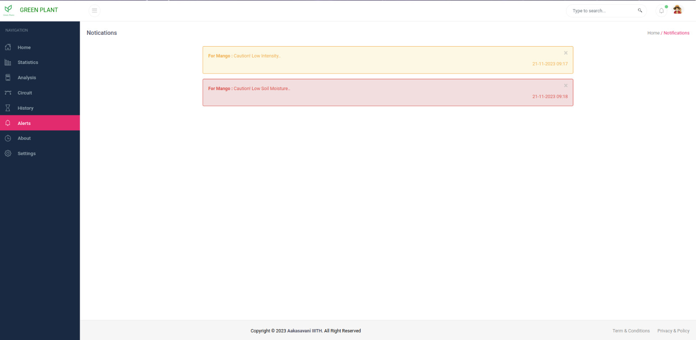
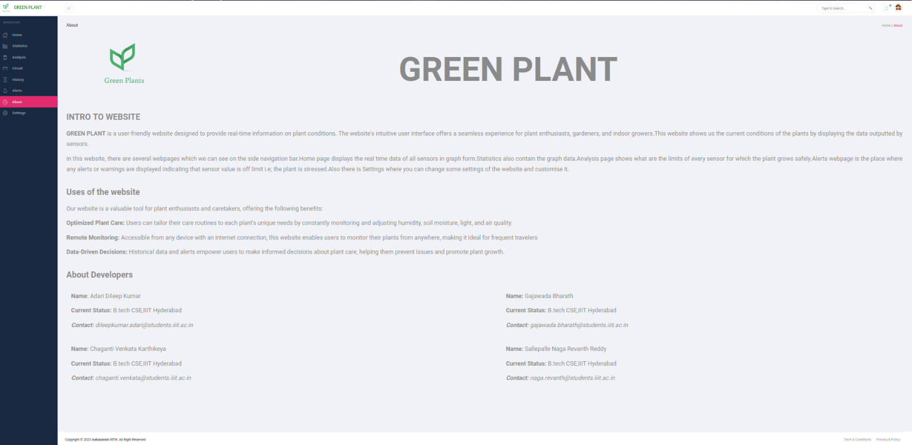
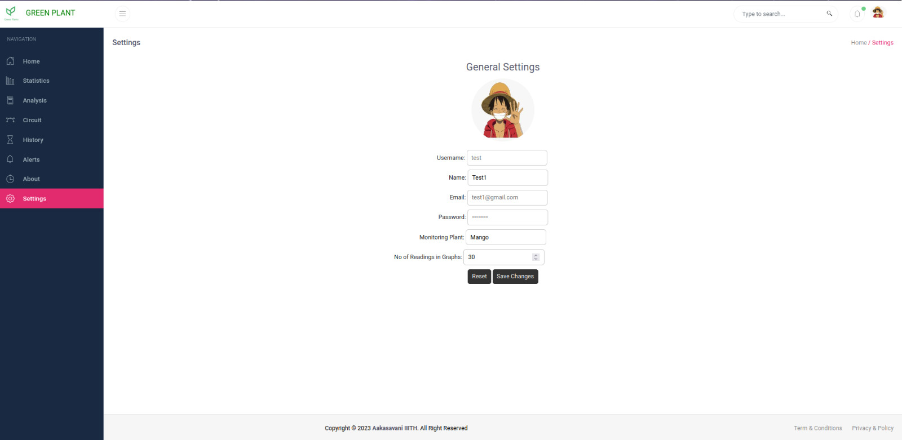

# Smart_farming

## Problem Statement:

 
Propose an IOT system to sense VOCs for accurately predicting onset of pathogen attack on the plant. A network on VOC sensor, temperature, humidity (soil), light, O2/CO2 can be deployed on the farm. In the project, these above mentioned sensor will be interfaced and deployed on an experimental farm (plants). Response to any stress introduced will be recorded via change in temperature, humidity & VOC levels of the plants.

	
## Motivation

## Sensors 

`DHT(11)` :  Temperature & Humidity (Range: Temp -> 0 - 50 C ; Humidity -> )
Working Principle :
 

`Soil Moisture`: 
Working Principle : 
- The Soil Moisture sensor uses capacitance to measure dielectric permittivity of the surrounding medium to measure the soil moisture.
- In soil the dielectric permittivity is function of water content.When water content increases the dielectric permittivity also increase.So when dielectric permittivity is high then the Voltage measured across the `Soil Moisture` pins decreases.

`SGP30` : CO2 and VOC  
Working Principle : 
- SGP30 uses Metal-oxide semiconductor to detect various gases.The sensor has MOX(Metal Oxide) and ASIC(Application Specific Integrated Circuit).
- `SGP30` mainly measures the concentrations of CO2 and TVOCs.The MOX sensor reacts to the presence of these gases ,causing changes in it's electric conductivity.
- The ASIC then converts these changes into digital signals , which are used to calculate the gas concentrations.

## Implementation

## How To Use ?

## Web Pages
- Home Page : Consists of the current values of sensors and Plot of VOC values​

  

- Statistics Page : Consists of Graphs of sensor data retrieved from Thingspeak.​

  

- Analysis Page : Consists threshold values of each sensor for the Plant selected by the user and the current values of each sensor. ​

  

- Circuit Page : Consists of the entire circuit diagram of the system.​

  

- History Page : Here the user can select Dates in which they want to see the sensor data generated between the timeline.​

  

- Alerts Page : When the current values of the sensors are not in the range of threshold values an alert is generated and is shown in Alerts Page.

​

  

- About Page : Consists of the information of the project and team members.​

  

- Settings Page : Here the user can make certain changes:​
    - The user can choose the number of values for observation in the Statistics Page.​
    - The user can change Plant and if the Plant is present in the Database then the corresponding Threshold values are shown in the Analysis Page.
    

  

## Analysis
- Graphs for shown in the Statistics page of the website of each sensor.The data obtained is Analysed and compared with the Threshold value of the selected plant.The Status shown in Analysis page is based on the values of Threshold values and Current values.

## Credits
